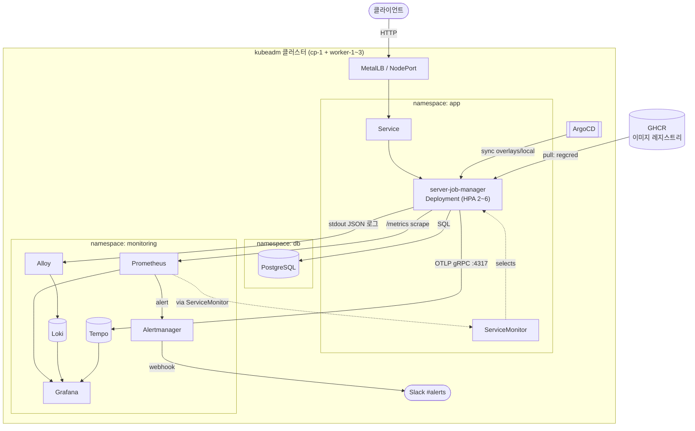
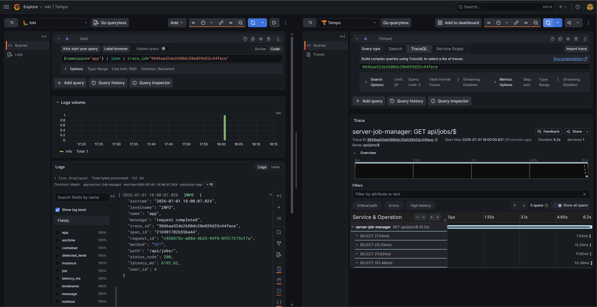
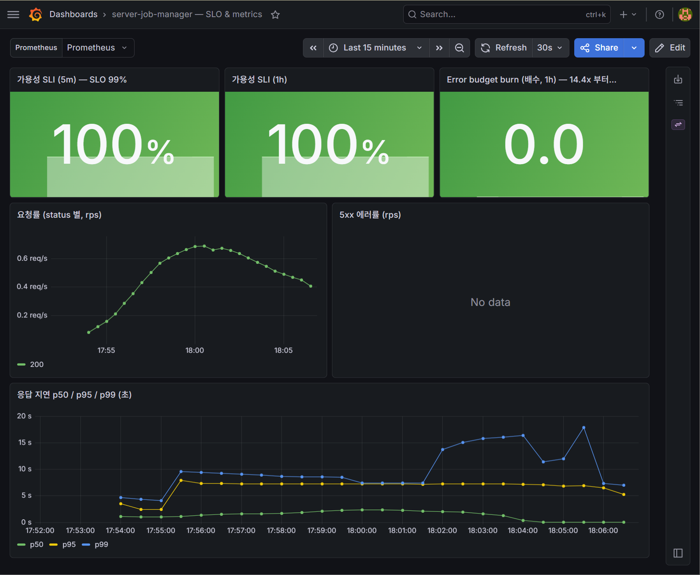
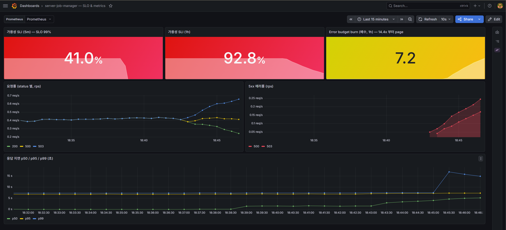
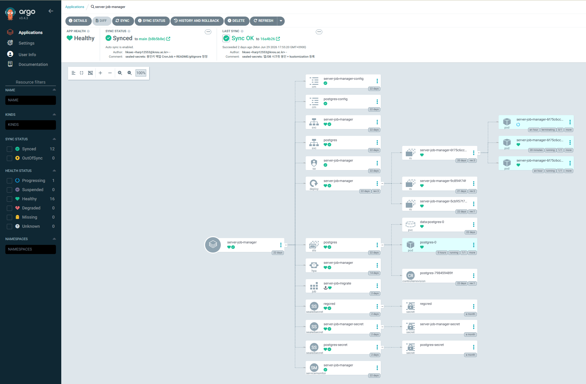
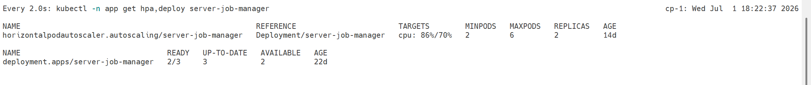
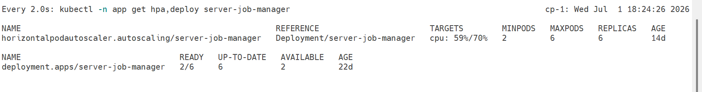
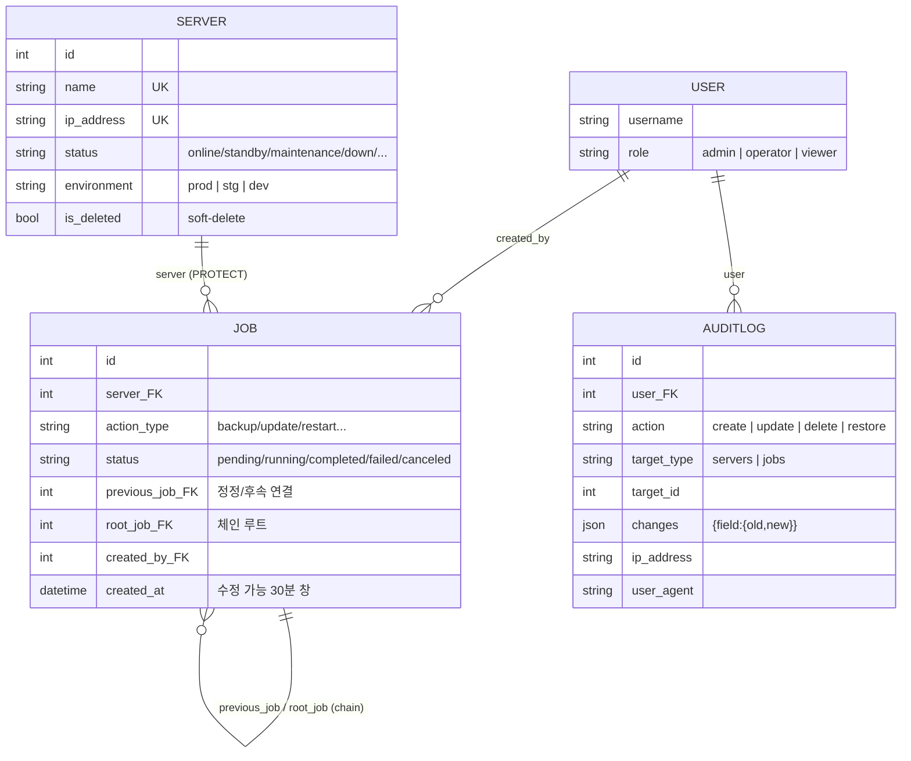
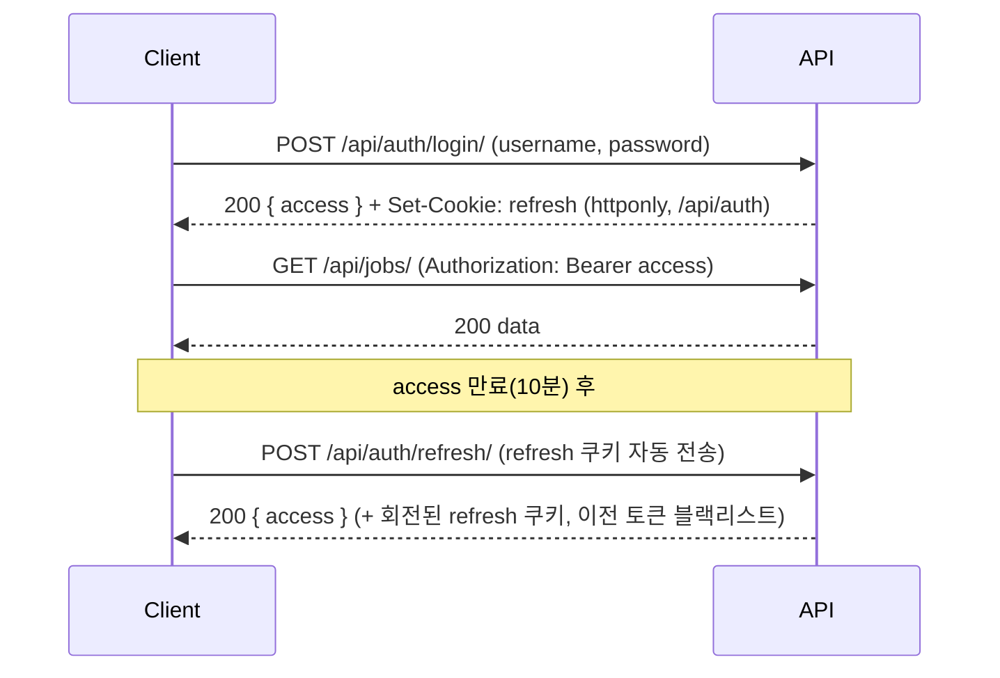

# server-job-history


> **GitOps · Observability · RBAC를 적용해 "운영 관점"의 백엔드 시스템을 직접 구축·검증한 개인 프로젝트.**
> 서버 운영 작업의 이력·권한·감사를 관리하는 REST API를, 이 앱 자체를 **GitOps(ArgoCD)로 배포하고
> 메트릭·로그·트레이스로 관측**하며 만들었습니다 — 특정 비즈니스가 아니라 **클라우드 운영 패턴을 검증한 실험 환경**.

**핵심 키워드** — Kubernetes · GitOps(ArgoCD) · Observability(Prometheus/Loki/Tempo) · RBAC · SLO/Error-budget · sealed-secrets · Django REST

## What / Why / Impact

- **What** — 서버 운영 작업(설치·점검·배포 등)을 **사람이 기록**하고 권한·감사와 함께 관리하는 REST API + 그 운영 환경
- **Why** — 운영 작업은 "누가·언제·무엇을" 했는지 **추적·통제**돼야 하고, 시스템 자체도 **장애·확장·배포**를 견뎌야 한다
- **Impact** — (서비스) 작업 이력 추적성 · RBAC · 감사 로그 / (운영) GitOps 배포 자동화 · SLO 장애 감지 · `trace_id` 원인 추적

**할 수 있는 것** — 서버 등록·상태 관리 · 작업 생성/정정([Job Chain](#핵심-4가지)) · 역할별 권한 검사(RBAC) · 감사 로그 조회 (API 상세는 [상세 문서](#상세-문서))

## 아키텍처

**읽는 법** — 세 흐름으로 나눠 보면 빠릅니다:
- **요청** — Client → Service → Django(app) → PostgreSQL
- **배포** — Git → ArgoCD → Kubernetes (이미지는 GHCR pull · PreSync 마이그레이션 → 롤링)
- **관측** — 앱의 Metrics·Logs·Traces → Prometheus/Loki/Tempo → Grafana(시각화) · Alertmanager(Slack 알림)



## 핵심 4가지

> 이 4개만 봐도 프로젝트 핵심이 들어옵니다. (세부·인프라 디테일은 [상세 문서](#상세-문서)로 접어둠)

1. **도메인 설계** — 서버·작업·감사 3도메인. 작업은 **하드 삭제 불가**(이력 보존), 수정은 **30분 창**, 정정은 **작업 체인**(root_job), 서버는 **soft-delete**.
2. **RBAC** — ADMIN/OPERATOR/VIEWER 3역할 × 자원별 권한 + **객체 소유권**(본인 작업만 수정) 2단계 검사.
3. **GitOps 배포** — ArgoCD가 git을 단일 소스로 self-heal 동기화, **PreSync 마이그레이션 → 롤링 업데이트**.
4. **Observability** — 메트릭·로그·트레이스를 **하나의 `trace_id`로 상관**, **SLO/error-budget 알림**(Slack)까지.

> **직접 구현(코드)** — RBAC 2단계 권한 · 감사 로그 diff · 관측 미들웨어 · 커스텀 Prometheus 메트릭 · 로그↔트레이스 상관 · JWT 흐름
> **직접 구축(인프라)** — kubeadm 클러스터 · ArgoCD · 관측 스택(Prometheus/Loki/Tempo) · sealed-secrets · 멀티스테이지 Docker

## 결과 · 검증

개인 프로젝트 규모에선 응답속도 절대값(몇 ms)보다 **"측정·검증 체계를 갖췄는지"** 가 핵심입니다.
부하 → 수집 → 시각화 → 알림이 한 줄로 연결됩니다:

```
k6 부하 → 앱 /metrics → Prometheus → Grafana(대시보드) · Alertmanager → Slack
                              └── 로그(Loki) · 트레이스(Tempo) ──┘  (trace_id로 상관)
```

- ✅ **GitOps 배포 파이프라인** — ArgoCD self-heal 동기화, PreSync 마이그레이션 → 롤링 업데이트 ([스크린샷](#스크린샷))
- ✅ **지연 분포 가시화** — Prometheus 히스토그램으로 **p50/p95/p99**를 대시보드에 시각화(절대값이 아니라 추세·분포를 본다)
- ✅ **병목 원인 추적** — 하나의 `trace_id`로 로그(Loki) ↔ 트레이스(Tempo) 교차. "p95는 높은데 DB 쿼리는 ms" → **병목이 DB가 아님을 규명**
- ✅ **HPA 오토스케일** — k6 부하로 **CPU 86%(>70%) → Deployment 2 → 6 replicas** 스케일 확인
- ✅ **SLO/error-budget 반응** — DB 장애 주입 시 **가용성 SLI 100% → 41% 급락 + 5xx 상승 + burn 상승**을 대시보드로 실시간 관측 (Slack webhook 연동 확인됨)
- ✅ **sealed-secrets** — 봉인 secret git 커밋 → 컨트롤러 복호화, ArgoCD 트리에 `sealedsecret → secret` 표시. 봉인키 백업 CronJob 동작 확인
- ✅ **노드 장애 복구** — 노드 다운 시 파드 자동 재스케줄 (local-path PVC 워크로드는 노드 복귀 시 복구)

## 까다로웠던 문제 (트러블슈팅)

lab을 운영하며 실제로 부딪힌 문제들 — "가장 어려웠던 것"으로 설명하기 좋은 것들:

- **GitOps ↔ HPA 충돌** — ArgoCD self-heal이 HPA가 조정한 `replicas`를 매니페스트 값으로 되돌려 플래핑 → `ignoreDifferences(/spec/replicas)`로 소유권 분리
- **StatefulSet + local-path 노드 고정** — 노드를 끄자 postgres가 `Pending`·prometheus가 죽은 노드에서 `Terminating` 정지(StatefulSet 특성) → 원인(PVC 노드 고정)을 파악하고 force-delete로 재스케줄
- **Prometheus 멀티프로세스 메트릭** — gunicorn 멀티워커에서 Gauge가 stale-label 문제 발생 → 매 scrape마다 DB를 집계하는 **커스텀 Collector**(멀티프로세스-safe)로 해결

> 각 문제의 대안·판단은 [설계 결정 · Lessons Learned](docs/design-decisions.md#배운-것-lessons-learned)에.

## Secret / Key 관리

GitOps에서 비밀을 git에 둘 수 없다는 문제를 **Bitnami sealed-secrets**로 해결.

- Kubernetes Secret 직접 관리 대신 SealedSecret 사용 → git에는 **암호문만** 저장
- 복호화는 클러스터 내 컨트롤러(개인키)만 수행, 원본 키는 외부 노출 없음
- 덕분에 **GitOps 파이프라인에서도 Secret을 안전하게 재현 가능**
- 봉인키 유실 대비 **백업 CronJob**으로 주기적 백업 (cp-1 디스크)

> 자세한 봉인·복구 절차는 [sealed-secrets README](deploy/manifests/sealed-secrets/README.md).

## 스크린샷

### 관측성 — 3-신호 상관관계
하나의 `trace_id`로 Loki 로그(왼쪽) ↔ Tempo 트레이스(오른쪽) 연결. DB 쿼리(SELECT)는 ms인데 요청 전체는 6.2s → **병목이 DB가 아님을 트레이싱으로 확인**.


### SLO · 장애 대응
정상과 **DB 장애 주입** 시를 대비 — 가용성 SLI가 100% → **41% 급락**, 5xx(500·503) 상승, error-budget burn 상승. **SLO가 실제로 반응함**을 확인.

| 정상 | DB 장애 주입 |
|---|---|
|  |  |

### GitOps 배포 (ArgoCD)
`Synced + Healthy` 리소스 트리 — SealedSecrets(`sealedsecret → secret`)·PreSync 마이그레이션 Job·HPA·ServiceMonitor 포함.


### 오토스케일 (HPA)
k6 부하로 CPU **86%(>70%)** 돌파 → replicas **2 → 6** 스케일.

| ① CPU 임계 초과 (트리거) | ② 6 replicas로 스케일 완료 |
|---|---|
|  |  |

## 설계 결정 (요약)

> 대안·트레이드오프·한계까지 담은 전체 기록: **[docs/design-decisions.md](docs/design-decisions.md)**

- **왜 kubeadm인가** — Managed(EKS)는 컨트롤플레인이 가려진다. **비용 0으로 쿠버네티스 내부(스케줄링·CNI·스토리지·인증서)를 직접 다뤄 이해도를 높이려** 노트북 VMware VM 위에 손수 구축. → [ADR-001](docs/design-decisions.md#adr-001)
- **왜 GitOps(ArgoCD)인가** — kubectl 수동 apply는 git과 클러스터가 어긋난다. git을 **단일 소스**로 self-heal 동기화 + PreSync 마이그레이션. (self-heal↔HPA 충돌은 `ignoreDifferences`로 해결) → [ADR-002](docs/design-decisions.md#adr-002)
- **왜 sealed-secrets인가** — GitOps라 Secret을 git에 못 올린다. 평문 주입은 재현성이 깨지고 Vault는 lab에 과함 → **암호문만 커밋**하는 sealed-secrets로 GitOps+보안 동시 만족. → [ADR-004](docs/design-decisions.md#adr-004)
- **왜 trace_id로 묶었나** — 메트릭의 "느리다"만으론 원인을 모른다. 3신호를 `trace_id`로 이어 **"지표 → 원인"까지 추적**(실제로 "요청 6s인데 DB는 ms → 병목이 DB 아님"을 규명). → [ADR-003](docs/design-decisions.md#adr-003)
- **왜 작업 삭제 불가 + 체인인가** — 운영 이력은 지우면 안 되는 자산. 삭제 대신 **정정 작업 체인**으로 추적성 보존. → [ADR-006](docs/design-decisions.md#adr-006)
- **왜 multi-window SLO인가** — 단일 창은 순간 스파이크에 오경보. 5m+1h 동시 조건으로 **지속 장애만 page**. → [ADR-005](docs/design-decisions.md#adr-005) · [런북](docs/runbooks/error-budget.md)

## 실행 (로컬)

요구사항: **Python 3.12**, **PostgreSQL**

```bash
python -m venv .venv && source .venv/bin/activate   # Windows: .venv\Scripts\activate
pip install -r requirements.txt
cp .env.example .env                                # DB_*, DJANGO_SECRET_KEY (DJANGO_ENV=local)
python manage.py migrate
python manage.py createsuperuser                    # role 기본 viewer
python manage.py runserver                          # http://localhost:8000/api/swagger/
```

## 문서

- 🧩 [도메인·API·인증·관측성·배포 상세](#상세-문서) — 아래 접이식 섹션
- 🧭 [설계 결정 기록(ADR) — 대안·트레이드오프·한계](docs/design-decisions.md)
- 📈 [모니터링 스택 설치/검증](deploy/manifests/monitoring/README.md)
- 🎯 [SLO / error-budget 런북](docs/runbooks/error-budget.md)
- 🔐 [sealed-secrets 봉인·복구 절차](deploy/manifests/sealed-secrets/README.md)
- 🧪 [부하 테스트(k6)](deploy/k6/README.md)

---

## 상세 문서

<details>
<summary><b>기술 스택 (전체)</b></summary>

| 영역 | 사용 |
|---|---|
| Backend | Python 3.12 · Django 5.2 · DRF · SimpleJWT · drf-spectacular |
| Data | PostgreSQL 17 · django-filter |
| Observability | django-prometheus · prometheus_client · OpenTelemetry · python-json-logger |
| Runtime | gunicorn(멀티프로세스) · whitenoise |
| Infra | Docker · GHCR · Kubernetes(kubeadm) · Kustomize · ArgoCD |
| Monitoring | kube-prometheus-stack · Loki · Tempo · Alloy · Grafana |
| Security | sealed-secrets(Bitnami) |
| Cluster | flannel · MetalLB · local-path · metrics-server |

</details>

<details>
<summary><b>도메인 모델 (ERD)</b></summary>



- **User** (`core.User`, `AbstractUser` 확장, 테이블 `users`) — `role` 기본값 `viewer`
- **Server** — `name`·`ip_address` 유니크, `is_deleted` soft-delete
- **Job** — `server`는 PROTECT, `root_job`으로 정정 체인. `can_edit()` = 생성 후 30분
- **AuditLog** — 시스템 자동 생성 읽기 전용, `changes`에 필드별 old→new diff

</details>

<details>
<summary><b>권한 (RBAC)</b></summary>

`apps/core/permissions.py` — 2단계 검사(`has_permission` 역할 게이트 → `has_object_permission` 소유권).

| 자원 / 동작 | VIEWER | OPERATOR | ADMIN |
|---|:---:|:---:|:---:|
| 서버 조회 | ✅ | ✅ | ✅ (삭제 포함) |
| 서버 생성·수정·삭제(soft) | ❌ | ✅ | ✅ |
| 서버 복구(restore) | ❌ | ❌ | ✅ |
| 작업 조회 | ✅ | ✅ | ✅ |
| 작업 생성 | ❌ | ✅ | ✅ |
| 작업 수정 | ❌ | ✅ (본인만) | ✅ (전체) |
| 작업 삭제 | ❌ | ❌ | ❌ (API 비활성) |
| 감사 로그 조회 | ❌ | ✅ (본인) | ✅ (전체) |

권한 거부(403)는 미들웨어가 `forbidden_requests_total{path, role}`로 집계.

</details>

<details>
<summary><b>API</b></summary>

인증: `Authorization: Bearer <access>`. 페이지네이션 `PAGE_SIZE=10`. 전체 계약은 실행 후 **Swagger**(`/api/swagger/`).

**인증** `/api/auth/`
| 메서드 | 경로 | 설명 |
|---|---|---|
| POST | `/api/auth/login/` | 로그인 → 본문 `access`, **Refresh는 httponly 쿠키**(`/api/auth`) |
| POST | `/api/auth/refresh/` | 쿠키 refresh로 `access` 재발급(회전+블랙리스트) |
| POST | `/api/auth/logout/` | refresh 쿠키 삭제 |

**서버** `/api/servers/`
| 메서드 | 경로 | 설명 |
|---|---|---|
| GET | `/api/servers/` | 목록(필터 `status`·`environment`·`is_deleted` / 검색 `name`·`ip_address`) |
| POST | `/api/servers/` | 생성 (OPERATOR·ADMIN) |
| GET/PUT/PATCH | `/api/servers/{id}/` | 조회·수정 |
| DELETE | `/api/servers/{id}/` | soft-delete (OPERATOR·ADMIN) |
| PATCH | `/api/servers/{id}/restore/` | 복구 (ADMIN) |

**작업** `/api/jobs/`
| 메서드 | 경로 | 설명 |
|---|---|---|
| GET | `/api/jobs/` | 목록(삭제 서버 작업 제외) |
| POST | `/api/jobs/` | 생성 — `previous_job` 주면 `root_job` 승계, 없으면 자기 자신이 root |
| GET/PUT/PATCH | `/api/jobs/{id}/` | 조회·수정(30분 창 + 소유권) — **DELETE 없음** |
| GET | `/api/jobs/{id}/chain/` | 같은 `root_job` 체인 시간순 |

**감사 로그** `/api/audit-logs/` — GET 목록(ADMIN 전체 / OPERATOR 본인), 필터 `action`·`created_at` 범위.

**문서·관측** — `/api/swagger/` · `/api/docs/` · `/api/schema/` · `/metrics` · `/health/liveness/` · `/health/readiness/`

</details>

<details>
<summary><b>인증 흐름</b></summary>



Access(10분)는 본문, Refresh(1일)는 **httponly 쿠키**(JS 접근 불가, `/api/auth` 경로 한정). 운영은 `COOKIE_SECURE=true`.

</details>

<details>
<summary><b>관측성 (Observability)</b></summary>

부팅 시 `config/wsgi.py`가 `setup_tracing()` 호출, `/metrics`는 커스텀 컬렉터 포함.

**① 메트릭** (`config/observability/metrics.py`)

| 메트릭 | 타입 | 라벨 |
|---|---|---|
| `login_total` | Counter | `result` |
| `job_created_total` / `job_updated_total` | Counter | `action_type`, `environment` |
| `forbidden_requests_total` | Counter | `path`, `role` |
| `server_count_by_status` | Gauge(커스텀 Collector) | `status`, `environment` — 매 scrape DB 집계(멀티프로세스 안전) |
| `django_http_responses_total_by_status_total` | (django-prometheus) | SLO 가용성 SLI 기반 |

**② 로그** — JSON, 모든 레코드에 `trace_id`/`span_id`/`request_id` 주입. health/metrics 경로 제외.
**③ 트레이스** — OTEL로 Django 요청 + psycopg2 쿼리 자동 span, OTLP/gRPC. `OTEL_TRACING_ENABLED=false`면 no-op.
**health** — liveness(DB 미접근, cascading 방지) / readiness(DB 실패 시 503).

**요청 파이프라인(미들웨어)**
```
PrometheusBefore → Security → WhiteNoise → Session → Common → CSRF
  → Authentication → RequestID → RequestLog → Messages → XFrame → PrometheusAfter
```

</details>

<details>
<summary><b>설정 · 환경변수</b></summary>

`config/settings/`에서 `base` → `local`/`production`/`test` 분기. 운영은 K8s ConfigMap/Secret 주입.

| 변수 | 기본/예시 | 설명 |
|---|---|---|
| `DJANGO_SETTINGS_MODULE` | `config.settings.production` | 설정 모듈 |
| `DJANGO_SECRET_KEY` | (secret) | 런타임 필수 |
| `DB_NAME`/`DB_USER`/`DB_PASSWORD`/`DB_HOST`/`DB_PORT` | — | PostgreSQL |
| `ALLOWED_HOSTS` | `*`(lab) | 콤마 구분 |
| `GUNICORN_WORKERS` | `3` | worker 수 |
| `APP_LOG_LEVEL` / `LOG_LEVEL` | `INFO` / `WARNING` | 로그 레벨 |
| `COOKIE_SECURE` / `SECURE_SSL_REDIRECT` | `false` | HTTPS 토글 |
| `OTEL_TRACING_ENABLED` | `false`→`true`(overlay) | 트레이싱 |
| `OTEL_EXPORTER_OTLP_ENDPOINT` | `tempo.monitoring.svc.cluster.local:4317` | OTLP 목적지 |
| `PROMETHEUS_MULTIPROC_DIR` | `/tmp/prom_metrics` | 멀티프로세스 메트릭 |

</details>

<details>
<summary><b>컨테이너 · 쿠버네티스 배포</b></summary>

**빌드**
```bash
docker build -t ghcr.io/hyegyeongseo/server-job-manager:<tag> .
docker push ghcr.io/hyegyeongseo/server-job-manager:<tag>
```
multi-stage, 비루트 uid 1000, gunicorn PID 1(SIGTERM→graceful). `collectstatic`은 `BUILD_TIME=true`로 DB 미접근. `<tag>`는 overlay `newTag`와 일치.

**배포** — ArgoCD가 `overlays/local`을 자동 동기화. 비밀은 sealed-secrets로 봉인돼 git 포함.
```bash
# (부트스트랩 1회) sealed-secrets 컨트롤러 설치 → deploy/manifests/sealed-secrets/README.md
kubectl apply -f deploy/argocd/app-server-job-manager.yaml
```
- 이미지 치환·OTEL 토글: `overlays/local` kustomize 패치
- DB 마이그레이션: PreSync Job 멱등 실행
- HPA: requests.cpu 기준 2~6, ArgoCD는 `/spec/replicas` ignoreDifferences

**비밀 취급** — sealed-secrets로 `*-sealed.yaml`(암호문)만 커밋, 복호화는 컨트롤러 개인키로 클러스터 안에서만. 봉인키 분실 시 전체 복호화 불가 → 주 1회 백업 CronJob(cp-1 디스크). 자세히는 [sealed-secrets README](deploy/manifests/sealed-secrets/README.md).

</details>

<details>
<summary><b>프로젝트 구조</b></summary>

```
.
├── apps/
│   ├── servers/        # 서버 인벤토리 (soft-delete/restore)
│   ├── jobs/           # 작업 이력 (체인·30분 수정창·chain)
│   ├── audit/          # 감사 로그 (읽기 전용 + create_audit_log)
│   └── core/           # User(role) · JWT · RBAC permissions
├── config/
│   ├── settings/       # base / local / production / test
│   └── observability/  # health · logging · metrics · middleware · tracing
├── deploy/
│   ├── manifests/
│   │   ├── server-job-manager/   # base(+ *-sealed.yaml) + overlays/local
│   │   ├── monitoring/           # kps · loki · tempo · alloy · SLO · 대시보드
│   │   ├── sealed-secrets/       # 봉인 절차 · webhook 봉인 · 봉인키 백업 CronJob
│   │   └── redis/                # Phase 3 예정(미연결)
│   ├── argocd/ · scripts/ · k6/
├── docs/runbooks/      # error-budget 등 런북
└── Dockerfile · gunicorn.conf.py · requirements.txt
```

</details>
